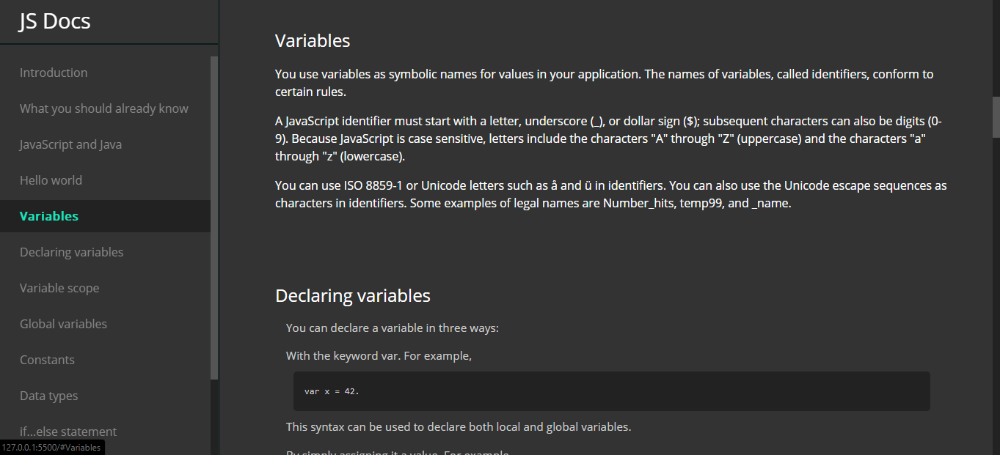

# FreeCodeCamp - Technical Documentation Page

> ### A project for FCC's Responsive Web Design Certificate

&nbsp;

- Satisfies all 15 user stories.
- Passes all 16 tests of Documentation project

----

----
&nbsp;

[More information](https://www.freecodecamp.org/learn/responsive-web-design/responsive-web-design-projects/build-a-technical-documentation-page) on this project.
